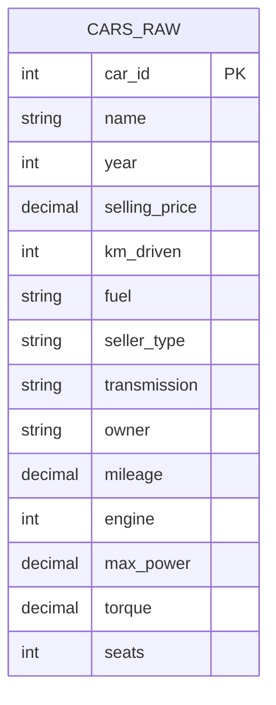

# [Project Title]
> # Car Price Analysis & Resale Valuation - SQL Portfolio Project

---

## ⚙️ Project Type Flags
> ### Project Type

- [x] Exploratory Data Analysis (EDA)
- [x] SQL Analysis / Querying
- [x] Data Cleaning / Wrangling
- [x] End-to-End (Data Cleaning, Validation, Analysis & Insights)
- [ ] Dashboard / Data Visualization
- [ ] Data Pipeline / ETL
- [ ] Predictive Modelling / Machine Learning
## Table of Contents
## Table of Contents
- [Project Overview](#project-overview)
- [Objectives](#objectives)
- [Project Scope & Tools](#project-scope--tools)
- [Repository Structure](#repository-structure)
- [Data Workflow](#data-workflow)
- [Data Model & Schema](#data-model--schema)
- [ERD — Entity Relationship Diagram](#erd--entity-relationship-diagram)
- [Analysis & Metrics](#analysis--metrics)
- [Key Insights](#key-insights)
- [Recommendations](#recommendations)
- [Assumptions & Limitations](#assumptions--limitations)
- [Future Enhancements](#future-enhancements)
- [Author](#author)

---

## 1. Project Overview

<### Executive Summary / Overview

The secondary automotive market in India features significant price variance driven by a complex mix of vehicle attributes, making accurate valuation difficult for buyers and sellers. This project evaluated a dataset of over 6,600 used car listings to identify the primary features driving resale values across different vehicle segments. Using MySQL, I cleaned raw text data (parsing numeric specifications from mixed strings) and conducted aggregated analyses across fuel types, transmission models, ownership tiers, and usage thresholds. The analysis revealed that transmission type and seller channel are the strongest price drivers—automatic cars commanded a 3x premium over manual equivalents, while dealer-listed vehicles retained double the value of private sales—providing clear, data-backed benchmarks for used-car pricing strategies.

---

### Project Scope & Objectives

* **Primary Objective:** Determine which vehicle attributes—specifically transmission, fuel type, seller channel, and ownership history—have the strongest statistical correlation with used-car resale prices.
* **Secondary Objective 1:** Quantify price differentials across core categorical segments (e.g., fuel types, manual vs. automatic transmissions, individual vs. dealer sellers).
* **Secondary Objective 2:** Measure depreciation trends relative to vehicle age (`year`) and accumulated mileage (`km_driven` ranges).
* **Secondary Objective 3:** Identify market density and peak value listings using custom SQL string parsing and aggregation functions.

* 
## 2. Objectives
### Project Objectives

* **Primary Objective:** Determine which core vehicle specifications—specifically transmission type, fuel type, mileage, age, and ownership history—have the strongest statistical relationship with used-car resale pricing.
* **Secondary Objective 1:** Quantify average price premiums and percentage differentials across categorical segments (e.g., automatic vs. manual transmissions, diesel vs. petrol engines, and dealer vs. individual sellers).
* **Secondary Objective 2:** Evaluate vehicle price depreciation curves relative to manufacturing year and mileage tiers (`km_driven` ranges).
* **Secondary Objective 3:** Identify top-tier luxury listings, high-volume car brands, and best-value opportunities using SQL string parsing, window ranking, and price-per-distance metrics.

> 💡 *Every analysis decision in this project traces back to one of these objectives.*
<
## 3. Project Scope & Tools

### Scope

| Dimension | Details |
|-----------|---------|
| **In Scope** | Individual vehicle listings from the Indian secondary car market; analysis of core specifications including selling price, transmission, fuel type, seller channel, ownership history, manufacturing year, mileage (`km_driven`), engine displacement (`CC`), and max power (`bhp`). |
| **Out of Scope** | Vehicle accident/maintenance histories, localized city/state geographic pricing, individual buyer demographics, and macro-economic factors (such as inflation or regional tax variations), as these fields were not present in the primary dataset. |
| **Time Period** | Historical snapshot of active secondary market car listings across manufacturing years 1983–2020. |
| **Granularity** | Row-level data representing individual car listings. |

### Tools & Technologies

<| Category | Tool(s) Used |
|----------|-------------|
| **Data Storage** | MySQL Server (Database), CSV files |
| **Data Processing** | SQL (`REGEXP_SUBSTR`, `CAST`, `ALTER TABLE`, `UPDATE`) |
| **Analysis** | MySQL Workbench (Aggregations, `CASE` statements, String Functions, Window Functions) |
| **Visualization** | Markdown Tables, MySQL Workbench Query Output |
| **Version Control** | Git / GitHub |
| **Documentation** | Markdown (`README.md`, `findings.md`) |

## 4. Repository Structure

.car-price-analysis/
│
├── README.md                 # Master project documentation & executive summary
│
├── data/
│   └── raw/                  # Original car listings export (car_data.csv)
│
├── sql/
│   ├── 01_data_cleaning.sql          # Numeric extraction, type casting, & NULL removal
│   ├── 02_exploratory_analysis.sql   # Aggregate pricing across fuel, transmission, & mileage
│   └── 03_insights.sql               # Brand ranking, price-per-km, & trend comparison
│
├── results/
│   └── findings.md           # In-depth business report and strategic recommendations
│
└── visuals/                  # Dashboard screenshots and chart exports

---

## 5. Data Workflow

<### Data Architecture & Schema Diagram

Because this project processes a single flat dataset (`cars_raw`), the schema consists of an entity table featuring a primary surrogate key along with engineered features derived during the data cleaning and analytics phases.

---

### Schema Summary & Feature Engineering

| Attribute Class | Columns | Operations / Transformations |
| :--- | :--- | :--- |
| **Primary Entity** | `cars_raw` | Single flat file representing raw vehicle listings (`6,643` initial records). |
| **Numeric Transformations** | `mileage`, `engine`, `max_power`, `torque` | Numeric extraction via Regex parsing (`REGEXP_SUBSTR`), converted from text (`VARCHAR`) to typed numeric attributes (`DECIMAL`, `INT`). |
| **Derived Features** | `brand`, `price_per_km`, `km_range` | String manipulation (`SUBSTRING_INDEX`), ratio feature engineering (`selling_price / km_driven`), and usage binning via conditional `CASE` logic. |
### Data Source & Lineage

1. **Source:** Kaggle / Indian Used Car Market Dataset (`car_data.csv`). The raw dataset contains 6,643 rows and 14 columns delivered as a flat CSV file containing mixed alphanumeric fields (e.g., `"17.8 kmpl"`, `"1248 CC"`, `"88.5 bhp"`).
2. **Ingestion:** Loaded into a local MySQL instance (`car_price_analysis` schema) using MySQL Workbench's Table Data Import Wizard, staging all initial fields into a raw table (`cars_raw`).
3. **Cleaning:** 
   - Extracted clean numeric values from string columns using `REGEXP_SUBSTR` regex expressions.
   - Cast string data types (`VARCHAR`) into proper numeric schema types (`DECIMAL(10,2)` for mileage, power, torque; `INT` for engine capacity).
   - Removed 0-mileage records (`WHERE mileage <= 0`) to eliminate erroneous data points before aggregation.
4. **Transformation:** 
   - Categorized vehicle usage by creating 4 distinct mileage buckets (`Under 50K km`, `50K-100K km`, `100K-150K km`, `Over 150K km`) using conditional `CASE` logic.
   - Extracted brand/manufacturer names from model strings using string parsing (`SUBSTRING_INDEX(name, ' ', 1)`).
   - Engineered a custom value metric (`price_per_km = selling_price / km_driven`) to identify high-value listings.
5. **Analysis:** Executed relational SQL queries using MySQL aggregations (`AVG`, `COUNT`, `MIN`, `MAX`), grouping, filtering, string operations, and conditional pivots (e.g., comparing Diesel vs. Petrol average prices across production years).
6. **Output:** 
   - Structured MySQL query scripts split across 3 modular `.sql` files (`01_data_cleaning.sql`, `02_exploratory_analysis.sql`, `03_insights.sql`).
   - Executive markdown documentation (`README.md` and `results/findings.md`) detailing key strategic business takeaways.
---

## 6. Data Model & Schema

<### Data Dictionary & Schema Notes

#### Table: `cars_raw`
Primary dataset containing vehicle specs, pricing, ownership, and technical attributes for used cars listed in India.

| Column Name | Data Type | Description | Example Value | Notes / Transformations |
| :--- | :--- | :--- | :--- | :--- |
| `name` | `VARCHAR(255)` | Full make and model description | `"Maruti Swift Dzire VDI"` | Brand parsed via `SUBSTRING_INDEX(name, ' ', 1)` |
| `year` | `INT` | Manufacturing year of the vehicle | `2014` | Range: 1983–2020 |
| `selling_price` | `DECIMAL(10,2)` | Resale price listed in Indian Rupees (₹) | `450000.00` | Target dependent variable for analysis |
| `km_driven` | `INT` | Total distance driven in kilometers | `145500` | Binned into usage tiers in `02_exploratory_analysis.sql` |
| `fuel` | `VARCHAR(50)` | Primary fuel type used by vehicle | `"Diesel"` | Categories: Diesel, Petrol, CNG, LPG |
| `seller_type` | `VARCHAR(50)` | Sales channel/entity listing the car | `"Individual"` | Categories: Individual, Dealer, Trustmark Dealer |
| `transmission` | `VARCHAR(50)` | Gearbox transmission type | `"Manual"` | Categories: Manual, Automatic |
| `owner` | `VARCHAR(50)` | Ownership status / transfer count | `"First Owner"` | Categories: First Owner, Second Owner, Third Owner, etc. |
| `mileage` | `DECIMAL(10,2)` | Fuel efficiency metric (kmpl or km/kg) | `23.40` | Extracted numeric floats from text string (`REGEXP_SUBSTR`) |
| `engine` | `INT` | Engine displacement capacity (in CC) | `1248` | Extracted integer from text string containing `"CC"` |
| `max_power` | `DECIMAL(10,2)` | Maximum engine power output (in bhp) | `74.00` | Extracted numeric floats from text string containing `"bhp"` |
| `torque` | `DECIMAL(10,2)` | Engine torque output | `190.00` | Extracted numeric values from raw text specification |
| `seats` | `INT` | Seating capacity of the vehicle | `5` | Integer value representing total passengers |

---

#### Key Field Relationships & Derived Metrics

- **Price per Kilometer (`price_per_km`):** Derived metric calculated as `selling_price / km_driven` to identify low-mileage, high-value vehicle opportunities.
- **Brand Extraction (`brand`):** Extracted first word from the `name` column to aggregate vehicle listings by vehicle manufacturer (e.g., Maruti, Hyundai, Honda, BMW).
- **Usage Tier (`km_range`):** Categorical buckets created via `CASE` logic (`Under 50K km`, `50K-100K km`, `100K-150K km`, `Over 150K km`) to model price degradation over mileage intervals.
-->
---

## 7. ERD - Entity Relationship Diagram
### Data Architecture & Schema Diagram

Because this project processes a single flat dataset (`cars_raw`), the schema consists of an entity table featuring a primary surrogate key along with engineered features derived during the data cleaning and analytics phases.

---

### Schema Summary & Feature Engineering

| Attribute Class | Columns | Operations / Transformations |
| :--- | :--- | :--- |
| **Primary Entity** | `cars_raw` | Single flat file representing raw vehicle listings (`6,643` initial records). |
| **Numeric Transformations** | `mileage`, `engine`, `max_power`, `torque` | Numeric extraction via Regex parsing (`REGEXP_SUBSTR`), converted from text (`VARCHAR`) to typed numeric attributes (`DECIMAL`, `INT`). |
| **Derived Features** | `brand`, `price_per_km`, `km_range` | String manipulation (`SUBSTRING_INDEX`), ratio feature engineering (`selling_price / km_driven`), and usage binning via conditional `CASE` logic. |

---

## 8. Analysis & Metrics

Defining explicit business metrics prior to evaluation ensures that analytical conclusions directly map to operational decisions. Below are the core metrics engineered and analyzed in this project:1. Resale Market Value (selling_price)Plain-Language Definition: The final listing/selling price of a used vehicle expressed in Indian Rupees (₹).Scope & Grain: Calculated as individual values and group averages (AVG), medians, and ranges across categorical dimensions (fuel type, transmission, seller type, ownership tier).Why It Matters: Serves as the primary dependent variable. Evaluating average and range differentials establishes baseline valuations and identifies premium drivers across market segments.2. Usage Intensity & Depreciation Tier (km_driven)Plain-Language Definition: The total cumulative distance driven by a vehicle in kilometers, segmented into four operational usage tiers (Under 50K km, 50K–100K km, 100K–150K km, and Over 150K km).Scope & Grain: Grouped categorical aggregation using conditional range logic (CASE).Why It Matters: Measures mechanical wear-and-tear expectations. Bucketing mileage quantifies non-linear price decay curves over vehicle usage lifespans.3. Distance Value Efficiency (price_per_km)Plain-Language Definition: The ratio of a vehicle’s listing price to its total accumulated mileage, representing the cost per kilometer driven.Scope & Grain: Calculated per vehicle record (selling_price / km_driven).Why It Matters: Standardizes price against vehicle usage to uncover relative bargains—flagging low-mileage vehicles listing below expected segment valuations.4. Fuel-Type Price SpreadPlain-Language Definition: The absolute and percentage difference in average selling price between diesel-fueled vehicles and petrol-fueled vehicles within identical production years (year).Scope & Grain: Annual average price aggregation pivoted across fuel categories.Why It Matters: Evaluates fuel economy and engine durability market preferences over time, isolating whether fuel type premiums remain consistent as vehicles age.Metrics Summary MatrixMetric NameMeasurement GrainPrimary Business PurposeAverage Selling PriceCategorical SegmentEstablishes base market valuation across fuel, transmission, and seller typesMileage BucketBinned Range (50K km intervals)Measures price depreciation relative to vehicle utilizationPrice per KilometerVehicle Listing LevelIdentifies high-value, under-priced vehicle listingsFuel Price PremiumAnnual Segment LevelTracks shifting buyer preference between diesel and petrol engines across vehicle age

### Analytical Approach
Analytical Approach & Methodology
This analysis was conducted as an exploratory data investigation aimed at identifying key price drivers, valuation anomalies, and depreciation trends across the Indian used-car market. Rather than testing a rigid econometric model, the analytical workflow was structured into four distinct iterative stages:

Data Ingestion & Integrity Validation:

The raw dataset was loaded into a local MySQL instance (car_price_analysis). Initial exploratory queries were executed to inspect column data types, verify schema constraints, and identify missing values, duplicates, and non-numeric characters across key specification columns.

Parsing & Schema Standardization:

Text-heavy measurement fields (mileage, engine, max_power, and torque) contained mixed alphanumeric strings with embedded units (kmpl, CC, bhp). I used MySQL regular expressions (REGEXP_SUBSTR) to extract clean numeric values and altered column data types (DECIMAL, INT) to enable mathematical aggregations. Invalid records (such as zero-mileage listings) were filtered out to prevent skewing distribution metrics.

Categorical Aggregation & Feature Engineering:

Using aggregated SQL queries, I segment-tested baseline metrics (AVG, MIN, MAX, COUNT) across primary vehicle characteristics: fuel type, transmission, seller type, and ownership tier. To evaluate non-linear mileage decay, I engineered a usage-tier feature (km_range) using conditional CASE logic. Additionally, string manipulation (SUBSTRING_INDEX) was applied to isolate car brands for volume and price comparison.

Derivation of Value Ratios & Market Insights:

To identify value opportunities beyond top-level price averages, I calculated a unit value metric (price_per_km) to isolate low-mileage, high-value vehicles. I also structured conditional pivot queries to track how the price gap between Diesel and Petrol vehicles evolved over production years (year).

### Key Metrics Defined

Metric,Plain-Language Definition,Why It Matters
Average Selling Price,"The mean listing price of vehicles grouped across specific categories (fuel, transmission, seller, owner).",Establishes market price baselines and quantifies the exact premium commanded by key features like automatic transmission or diesel engines.
Mileage Tier (km_range),"Accumulated vehicle distance grouped into 50,000 km usage intervals.",Measures mechanical utilization and helps quantify the rate of price depreciation as vehicle mileage increases.
Distance Value Ratio (price_per_km),The ratio of a car's selling price relative to its total driven distance (selling_price / km_driven).,"Standardizes vehicle cost against usage to identify low-mileage, high-value buying opportunities."
Fuel Price Premium,The year-over-year average price differential between diesel and petrol vehicles.,Evaluates whether fuel efficiency and engine type preferences impact long-term resale value retention as cars age.

### Methods Used

-
### Analytical Techniques & Methods
---
- [x] **Descriptive Statistics:** Summary metrics (`AVG`, `MIN`, `MAX`, `COUNT`) to measure price distribution and central tendency across core vehicle attributes.
- [x] **Segmentation & Group Comparison:** Categorical price analysis across key dimensions (`fuel`, `transmission`, `seller_type`, `owner`).
- [x] **Binned Usage Analysis:** Segmentation of accumulated mileage (`km_driven`) into usage tiers using conditional `CASE` logic to evaluate non-linear price decay.
- [x] **Time-Series / Cross-Sectional Analysis:** Tracking average price trends across manufacturing years (`year`) to analyze vehicle age depreciation.
- [x] **Engineered Ratio Analysis:** Unit metrics (`price_per_km = selling_price / km_driven`) to identify high-value, under-priced vehicle listings.
- [x] **String Parsing & Text Aggregation:** Feature extraction via `SUBSTRING_INDEX` to isolate car brands for market volume and price benchmarking.
---

## 9. Key Insights

  ### Key Insights & Business Implications

**Insight 1: Transmission Premium Commands a Luxury Multiplier**
Automatic vehicles average **₹1.32M** compared to **₹455K** for manual cars—a **~3x (190%) price premium**. This wide gap indicates that automatic transmissions in this market are heavily concentrated in upper-tier car segments and luxury brands rather than being standard across entry-level models. For dealerships, inventory allocation should treat automatic vehicles as high-margin, premium listings requiring distinct marketing and financing packages.

**Insight 2: Seller Type Markup Reflects Reconditioning and Trust Value**
Dealer-listed cars command nearly **double the resale price** of individual seller listings (**₹935K vs. ₹484K**). Rather than pure price inflation, this margin reflects value-added services such as multi-point inspections, refurbished aesthetics, and buyer trust. For private sellers, this highlights a significant loss in equity; providing verified maintenance records or third-party inspection reports could help bridge the ~₹450K price gap.

**Insight 3: Diesel Retains Higher Capital Value Despite Age**
Diesel cars sell at a **67% higher average price** than petrol equivalents (**₹648K vs. ₹387K**), maintaining a clear pricing advantage across nearly all manufacturing years. This persistent premium suggests buyers prioritize lower running costs, fuel efficiency, and long-term engine durability over initial capital outlay. Dealerships can confidently price used diesel models higher even at elevated vehicle ages.

**Insight 4: Depreciation Steepens Materially Beyond the First Owner**
Resale price drops sharply after the first ownership transition, declining by **₹100K–200K** per additional owner. First-owner vehicles retain maximum market liquidity and demand, while multi-owner listings experience extended inventory turn times. Valuation algorithms and pricing tools should apply non-linear depreciation discounts once a car crosses into second- or third-ownership status.
---

## 10. Recommendations

Priority,Recommendation,Based On,Suggested Owner
High,Create Dedicated Premium Packages for Automatic Vehicles: Package automatic inventory with targeted financing terms and extended warranty options to capture buyer willingness to pay at the ~₹1.32M price tier.,Insight 1: Automatic Transmission Premium (~3x higher average price),Sales & Dealership Operations
High,"Institute Certified Inspection Packages for Private Sellers: Develop a value-added ""Inspection & Warranty Certification"" product that individual sellers can purchase to validate vehicle condition, bridging the ~₹450K dealer-versus-private price gap.",Insight 2: Dealer Markup vs. Private Listing Price Gap,Product / Business Development
Medium,"Optimize Procurement Rates for Used Diesel Vehicles: Target second-hand diesel inventory with full service histories, pricing them confidently above petrol equivalents due to strong capital retention as vehicle age increases.",Insight 3: Diesel Capital Value Retention,Inventory Acquisition / Buying Team
Low,Implement Non-Linear Valuation Steeps for Multi-Owner Cars: Adjust automated trade-in valuation models to apply steeper pricing discounts on 2nd- and 3rd-owner vehicles to improve turn-around time and prevent margin compression.,Insight 4: Multi-Owner Price Depreciation Curve,Pricing & Analytics Team

---

## 11. Assumptions & Limitations

### Assumptions & Limitations

### Assumptions
- **Uniform Regional Currency Baseline:** All listed selling prices (`selling_price`) are assumed to be recorded in Indian Rupees (₹) and reflect nominal transaction values without regional adjustments or historical inflation indexing.
- **Accurate Distance Accumulation:** Odometer values (`km_driven`) are assumed to be reported accurately without rollback or fraudulent manipulation by sellers.
- **Single-Location Snapshot:** Listing attributes represent a static point-in-time snapshot of the active secondary market across India, assuming seller descriptions (trim, displacement, power output) were categorized consistently.

### Limitations
- **Omission of Maintenance & Accident Records:** The dataset lacks service histories, accident records, and structural damage logs—critical variables that heavily influence secondary market valuations regardless of mileage or age.
- **Absence of Geographic Granularity:** Pricing is aggregated nationally. Geographic variations (such as higher demand for SUVs in rural terrains or localized tax differences across states) could not be modeled.
- **Listing Price vs. Final Sale Price Bias:** Data reflects initial asking prices rather than verified, negotiated settlement prices, which may overestimate actual transaction values across certain seller types.
- **Unmeasured Technical Features:** Important pricing variables such as safety ratings, infotainment upgrades, tire condition, and insurance coverage status were absent from the primary dataset.

> *The goal here is pre-emptive Q&A. A thoughtful reviewer will look for these boundaries—documenting them up front demonstrates analytical rigor and business maturity.*
> 
---

## 12. Future Enhancements

  ### Next Steps & Future Enhancements

- [ ] **Incorporate Regional & Location-Based Granularity:** Join state-level or city-level location data into the dataset to account for regional price variations, local fuel tax differentials, and urban vs. rural vehicle demand.
- [ ] **Integrate Vehicle Maintenance & Accident History:** Ingest service records, insurance claim logs, and accident indicators to isolate how mechanical health impacts resale pricing alongside mileage and age.
- [ ] **Automate Ingestion & Cleaning via Orchestration Pipelines:** Replace manual MySQL Workbench imports with a Python/SQL ETL pipeline (e.g., using `SQLAlchemy` or `dbt`) to automatically ingest, clean, and validate new batch CSV exports.
- [ ] **Build a Predictive Pricing Model:** Train a supervised regression model (e.g., Random Forest or XGBoost) on the cleaned SQL dataset to predict expected car listing prices and flag statistically underpriced vehicles in real time.
---
---

## 14. Author

**[ANEG YANNICK]*

- 🔗 (https://www.linkedin.com/in/aneg-yannick-19692a432/)]
-
- 📧 yannickaneg23@gmail.com]

*Last updated: [may 2026]*

